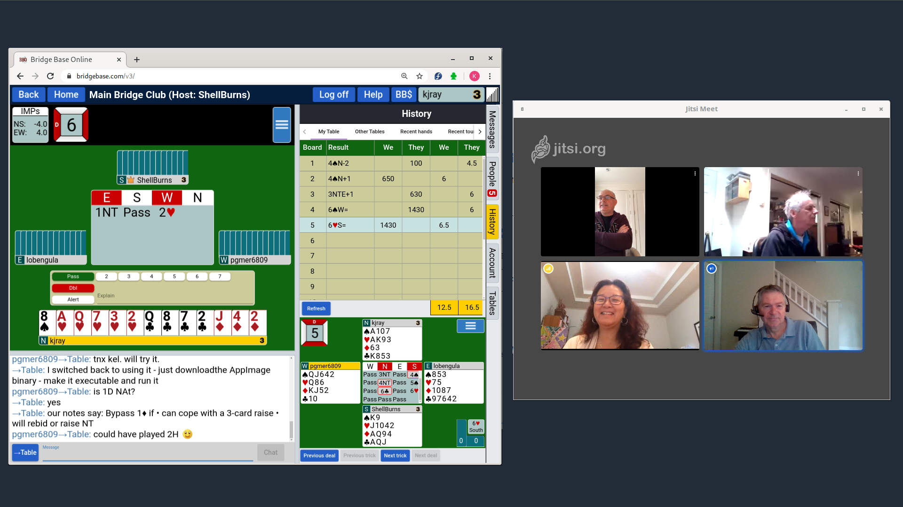

# Using Jitsi Meet with BBO

<!-- {: .center-image } -->

## Some Background

 [Jitsi Meet](https://jitsi.org/jitsi-meet) is totally anonymous
  * there are no accounts, therefore no registration etc.
  * any info you choose add to your profile is saved only on your
    device and only shared with other participants
	
Therefore, there is no built-in mechanism to invite anyone because the
servers don't know how to contact you.

## What Device?

If you can, it's preferable to use
  * a desktop computer with a camera in or on top of the monitor
  * a laptop on your desk with the camera at head height -- you might
    need to put the laptop on a stack of books and use an external
    mouse

because

  * we get a more natural view of you looking straight at the camera
    instead of downwards to a phone or tablet
  * it's easy to do things like mute or unmute your sound if you don't
    need to touch your phone

When also using BBO, you can shrink the Jitsi-Meet window and have it
beside the BBO window, or on a second monitor.

## If you must use your phone or tablet

During a meeting, use your phone in landscape mode to match what the
PC and laptop users do. Mount it at head height just beside or above
your computer screen.

## Software Installation

**PC or Laptop**

None. Use a chromium based web-browser; Google-Chrome, Chromium or Brave

**Phone or Tablet**

Install *Jitsi Meet* from the app store (play store for android)

## Settings

**PC or Laptop**

  * Go to <https://meet.jit.si>
  * Click on the gear symbol (⚙) in the upper right
  * In `Devices`, check that you see video of yourself and that
    audio is working
  * In `Profile`, add your name, and possibly your BBO name too
  * Click `[ Ok ]` to close the Settings pane

**Phone or Tablet**

  * Open Jitsi Meet
  * Tap on the drop-down menu icon (☰) in the upper left
  * Tap on Settings (⚙)
  * Add your name, and possibly your BBO name too
  * Tap the left arrow (←) at the top to finish

## Meeting Rooms

Meetings are defined by a *Room Name* which has an associated link
constructed from the server URL followed by the room name with spaces
removed.

_Example_
> **Room name:** `Correct Horse Battery Staple`  
> **Link:** https://meet.jit.si/CorrectHorseBatteryStaple

Room names

  * are NOT case sensitive
  * may contain plus, minus, underscore or dot, but no other
    special characters

## Joining a Meeting

Since there are no invitations, someone must send you the room name or
link by some other method; email, text, phone, ...

**PC or Laptop**

  * If you received a link, then open it in your browser
  * If you received a room-name
    - open <https://meet.jit.si>
    - paste or type the room-name into `Start a Meeting` (ignore the
	  randomly-generated names; you can type or paste over them)
	- click `[ GO ]`
	
**Phone or Tablet**

  * Paste or type the room name (or the link) into `Enter room name`

## Starting a Meeting

Starting a meeting is just like joining a meeting except that you can
choose the room name.  If you don't want to choose, you can use a name
that is randomly generated by the Jitsi-Meet server.

You can add a password to a meeting through the `more actions` menu.
This is generally not necessary unless you plan to advertise the room
name more widely.  In that case it's necessary to distribute the
password by private communication to the intended participants.

## Participating in a Meeting

Once you have joined a meeting, there are several options you can find
from the icons and menu and the bottom of the screen windows.

The tile view is good for a BBO session where there will be times when
no-one is talking.
